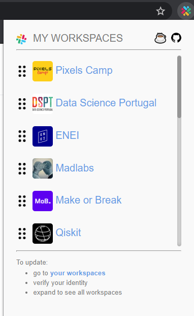

  <h1>
    My Slack Workspaces
  </h1>

  

    <strong>A simple browser extension to easily access multiple slack workspaces.</strong>
  

  

    Available on <a href="https://chrome.google.com/webstore/detail/gbpffheebbifdigfogmodlfidmekacnd">Chrome webstore</a> and <a href="https://addons.mozilla.org/en-US/firefox/addon/my-slack-workspaces/">Firefox addons</a>
  

  

### Contributing
1. fork project
2. run `npm install`
3. run `npm run chrome-watch` or `npm run firefox-watch` or `npm run opera-watch` during development
   1. the way to upload development extensions will vary depending on the browser see below
   2. point it to the correct folder that is maintained with live-reload inside the `build/` folder
4. run `npm run build` when ready for final tests
5. pull-request once ready

##### Load the extension in Chrome & Opera
1. Open Chrome/Opera browser and navigate to chrome://extensions
2. Select "Developer Mode" and then click "Load unpacked extension..."
3. From the file browser, choose to `my-slack-workspaces/build/chrome` or (`my-slack-workspaces/build/opera`)

##### Load the extension in Firefox
1. Open Firefox browser and navigate to about:debugging
2. Click "Load Temporary Add-on" and from the file browser, choose `my-slack-workspaces/build/firefox`

## Packaging
Run `npm run dist` to create a zipped, production-ready extension for each browser. 